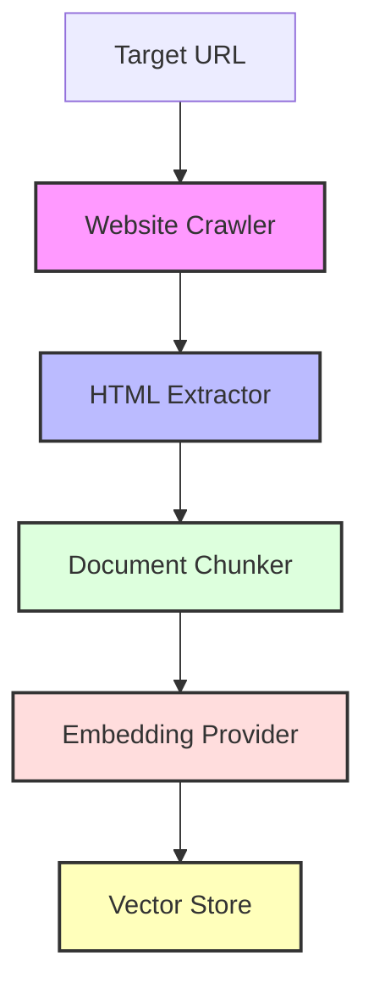
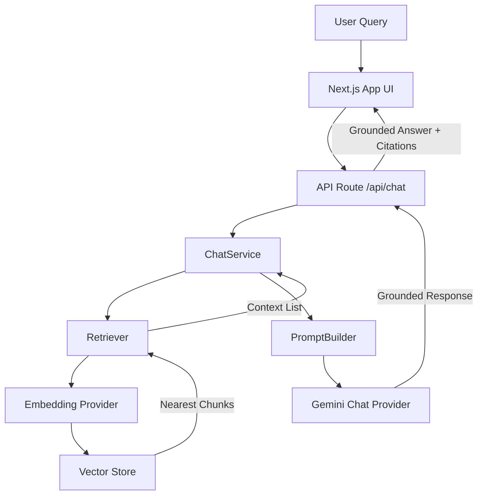

# RAG Website Assistant

A production-grade, highly modular Retrieval-Augmented Generation (RAG) system built with **Next.js (App Router)**, **TypeScript**, **LanceDB**, and **Google Gemini AI**. 

The system recursively crawls target websites (obeying `robots.txt` and rate limits), extracts clean readable markdown-like structures, segments contents using overlapping semantic snapping boundaries, embeds chunk payloads, and stores vectors locally. A grounded chat interface queries the vector space to generate natural language answers with source-backed citations.

---

## 🏗️ Architecture & Component Flows

The project is structured around a decoupled **Clean Architecture**, relying on strict **Dependency Injection (DI)** and abstractions. 

### 1. Ingest & Indexing Pipeline Flow
This pipeline crawls a target domain, processes its HTML contents, and indexes the resulting chunks into the vector store.


*   **Website Crawler** (`src/lib/crawler`): Performs domain-constrained, depth-limited Breadth-First Search (BFS) page scraping. OBEYS `robots.txt` rules and applies configured request delays to prevent rate blocking.
*   **HTML Extractor** (`src/lib/rag/html-extractor`): Employs Mozilla Readability on a simulated JSDOM (with Cheerio as a fallback) to strip scripts, styles, and headers, returning semantic Markdown structures (lists, headings, code blocks).
*   **Document Chunker** (`src/lib/rag/chunker`): Segments page markdown content into overlapping text blocks. Snaps window breaks to paragraphs, sentences, or word boundaries to preserve linguistic context.
*   **Embedding Provider** (`src/lib/llm/gemini-embedding`): Batches strings, communicates with the Gemini Embedding API, handles unit L2 normalization, and propagates retry information.
*   **Vector Store** (`src/lib/db/lancedb-store`): Receives embedded document chunks and persists them in LanceDB utilizing Apache Arrow formats. Supports vector similarity lookups and SQL-like metadata filtering.

---

### 2. Retrieval & Chat Query Flow
This pipeline retrieves relevant document chunks from the vector store to ground the LLM's natural language response.


*   **ChatService** (`src/lib/chat/chat-service`): Coordinates the query pipeline by fetching context, prompting the model, and structuring output citations.
*   **Retriever** (`src/lib/chat/retriever`): Requests embeddings for user query strings and runs similarity searches on the vector store to return top matching context blocks.
*   **PromptBuilder** (`src/lib/chat/prompt-builder`): Assembles system instructions, places cited chunks into contextual templates, and prepares generation prompts.
*   **Gemini Chat Provider** (`src/lib/llm/gemini-chat`): Calls the Gemini LLM generator to write grounding responses restricted to the retrieved context scope.

---

## 🛠️ Tech Stack

*   **Frontend**: React 19 (Client Components), TailwindCSS
*   **Backend**: Next.js 16 (App Router), Node.js
*   **LLM Generator**: Gemini 3.1 Flash Lite (`gemini-3.1-flash-lite`)
*   **Embedding Generator**: Gemini Embedding 2 (`gemini-embedding-2`, 768 Dimensions)
*   **Vector Database**: LanceDB (Embedded local file database) / Apache Arrow
*   **Languages**: TypeScript (Strict checks)
*   **Key Libraries**: Cheerio, jsdom, robots-parser, uuid, @google/genai SDK

---

## 📂 Project Structure

```text
├── src/
│   ├── app/                      # Next.js UI pages and API endpoints
│   │   ├── api/
│   │   │   ├── chat/             # Grounded generation endpoint
│   │   │   └── index/            # Real-time event streaming indexing endpoint
│   │   ├── layout.tsx            # Root HTML layout and viewport settings
│   │   └── page.tsx              # Front-end UI (Crawler logs console & Chat history panels)
│   ├── lib/                      # Core business and infrastructure packages
│   │   ├── chat/                 # Grounded chat orchestrators, prompt engines, retrieval
│   │   ├── crawler/              # BFS website crawlers, normalizers, robots checkers
│   │   ├── db/                   # LanceDB vector database store and memory-mocks
│   │   ├── llm/                  # Gemini embedding and chat completions providers
│   │   └── rag/                  # HTML extractors, sliding-window chunkers, index orchestrators
│   └── types/                    # Core domain schemas, interfaces, config types
```

---

## ⚡ Environment Variables

Create a `.env.local` file in the root directory:

```env
# Required: API key to access Google Gemini AI services
GEMINI_API_KEY=your_gemini_api_key_here

# Optional: Override default chat model (defaults to gemini-3.1-flash-lite)
GEMINI_CHAT_MODEL=gemini-3.1-flash-lite
```

---

## 🚀 Installation & Local Development

1.  **Clone the Repository**:
    ```bash
    git clone https://github.com/your-username/rag-website-assistant.git
    cd chat-with-website
    ```

2.  **Install Dependencies**:
    ```bash
    npm install
    ```

3.  **Run Dev Server**:
    ```bash
    npm run dev
    ```
    Access the UI at `http://localhost:3000`.

4.  **Build for Production**:
    ```bash
    npm run build
    npm run start
    ```

---

## 🔌 API Endpoints

### 1. Ingest website (`POST /api/index`)
Starts the crawler and indexing pipeline, returning a live **Server-Sent Event (SSE)** stream of log updates.

*   **Request URL**: `/api/index`
*   **Headers**: `Content-Type: application/json`
*   **Payload JSON**:
    ```json
    {
      "url": "https://example.com",
      "maxPages": 5
    }
    ```
*   **Response Stream Format**:
    ```text
    data: {"type":"progress","stage":"initialize","message":"Clearing existing vectors..."}

    data: {"type":"progress","stage":"crawl","message":"Crawling site: https://example.com..."}

    data: {"type":"complete","message":"Successfully crawled and indexed: https://example.com","meta":{"url":"https://example.com","maxPages":5,"totalPages":1,"totalChunks":3,"durationMs":8250}}
    ```

---

### 2. Query Grounded Assistant (`POST /api/chat`)
Queries the vector database for matching chunks and generates a grounded response with source citations.

*   **Request URL**: `/api/chat`
*   **Headers**: `Content-Type: application/json`
*   **Payload JSON**:
    ```json
    {
      "message": "What is this domain used for?",
      "topK": 2,
      "temperature": 0.2
    }
    ```
*   **Response JSON**:
    ```json
    {
      "answer": "This domain is designated for use in illustrative examples in documents...",
      "sources": [
        {
          "title": "Example Domain",
          "url": "https://example.com/",
          "chunkNumber": 1,
          "totalChunks": 1,
          "distance": 0.00092
        }
      ]
    }
    ```

---

## ⚙️ Architecture Decisions

*   **Strict Dependency Injection**: Core services like `IndexingPipeline` and `Retriever` accept abstract interfaces (`VectorStore`, `EmbeddingProvider`, `ChatProvider`) in their constructors rather than instantiating concrete classes directly.
*   **Composition Root**: Concrete classes are instantiated exclusively in the factory level (`src/lib/chat/factory.ts`), isolating creation details from the rest of the application.
*   **Unified Delete Abstraction**: Deletes are structured generically via `delete(options: SearchOptions)` using query filters (`MetadataFilter[]`), which are converted to SQL-like filters (`where` clauses) inside the LanceDB store.
*   **Dynamic Telemetry Logging**: Instead of hardcoding database branding, logging queries resolve names dynamically at runtime using `this.vectorStore.constructor.name`.

---

## ⚠️ Current Limitations

1.  **Rate Limit Thresholds**: The Gemini API has a token/requests per minute quota constraint. Though the backend handles transient 429 errors gracefully using countdown halts and retries, heavy crawls can exhaust quotas quickly.
2.  **No JavaScript Rendering**: The page crawler downloads raw HTML contents. Websites that render content exclusively using client-side JavaScript (SPAs) will be indexed as blank/empty.
3.  **Local Database Locking**: LanceDB runs as an embedded library. It performs file writes directly on disk, which means concurrent indexing operations can cause file lock clashes.

---

## 🔮 Future Improvements

*   **Headless Browser integration**: Introduce Playwright or Puppeteer crawlers to support sites requiring client-side JS rendering.
*   **Database Cloud Adapters**: Implement pgvector (Supabase) or Pinecone adapters to scale indexing throughput beyond local file limitations.
*   **ParallelBFS Crawler**: Accelerate page parsing using concurrent BFS queues with worker thread configurations.
*   **Streaming Chat Responses**: Use chunked response transfers for `POST /api/chat` to allow word-by-word streaming in the chat history interface.

---

## 🧪 Testing

Standalone test scripts reside in the codebase to verify components independently:

*   **Mock store unit tests**: Asserts search metrics, capability descriptors, and generic filter deletions.
    ```bash
    npx tsx src/lib/db/test-mock-store.ts
    ```
*   **LanceDB store integration tests**: Verifies connection initializations and Arrow schemas.
    ```bash
    npx tsx src/lib/db/test-lancedb.ts
    ```
*   **Rate limit resiliency tests**: Simulates API HTTP 429 blocks to verify countdown queues and retry thresholds.
    ```bash
    npx tsx src/lib/rag/test-rate-limit.ts
    ```
*   **End-to-end RAG workflow tests**: Runs crawling, HTML sanitization, indexing, database vector seeding, and grounded question answering in a single workflow.
    ```bash
    npx tsx src/lib/chat/test-end-to-end.ts
    ```

---

## 📸 Screenshots

### 🖥️ Home Page & Settings


### 📊 Indexing Progress & Terminal Logs


### 💬 Chat interface with Grounded Sources

---

## 🎥 Demo Video & Deployment

*   **Live Demo Deployment**: `[Placeholder: Link to live hosted deployment instance]`
*   **Product Demo Recording**: `[Placeholder: Link to YouTube / Loom video demonstration]`

---

## 📝 License

This project is **Private & Proprietary** and designated for internal review and assessment only.
