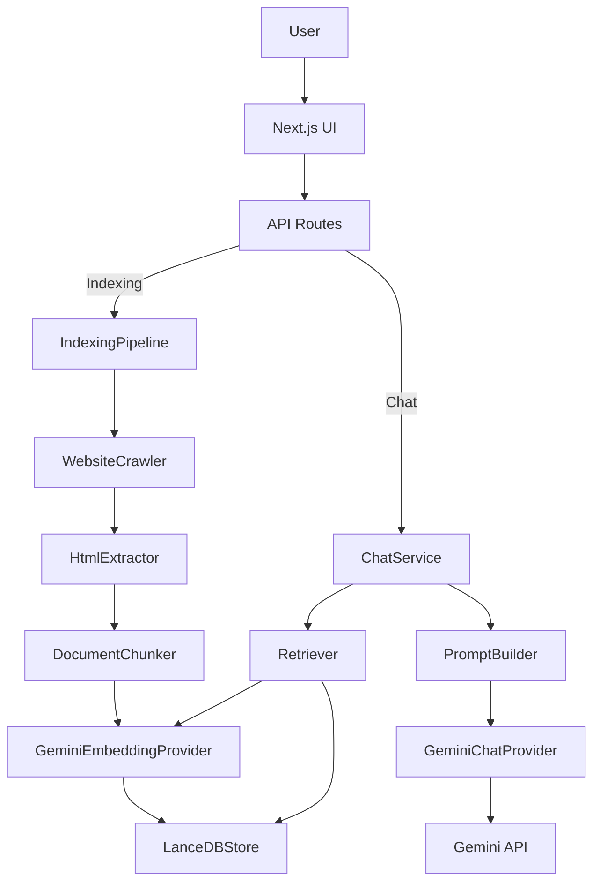

# Architecture

## Overview

The application is designed as a modular RAG system with a clean separation between:

- website ingestion and indexing,
- semantic retrieval,
- prompt construction,
- LLM generation,
- and frontend interaction.

The architecture is intentionally layered with abstraction boundaries between the UI, API, orchestration services, LLM providers, and vector store adapter.

## High-Level Architecture


```

## Component Responsibilities

### Frontend (`src/app/`)

- `page.tsx`: User interface for website indexing and chat interactions.
- Indexing form sends `POST /api/index` and consumes SSE progress.
- Chat form sends `POST /api/chat` and displays grounded responses with citations.

### API Routes

- `src/app/api/index/route.ts`: Starts the indexing pipeline and streams progress events.
- `src/app/api/chat/route.ts`: Handles chat queries, validates input, resolves dependencies, and returns LLM answers.

### Factory / Composition Root

- `src/lib/chat/factory.ts`: Creates shared dependencies for both chat and indexing pipelines, including embedding provider, vector store, and model providers.
- Ensures consistent database configuration and reuse of `./data/lancedb` namespace.

### Indexing Pipeline

- `src/lib/rag/indexing-pipeline.ts`: Orchestrates crawling, extraction, chunking, embedding, and storage.
- Enforces config validation, abort handling, batched embeddings, and progress telemetry.

### Retrieval Pipeline

- `src/lib/chat/retriever.ts`: Converts a user query into an embedding and performs vector similarity search.
- Returns top-k `DocumentChunk` objects with distance scores.

### Prompt Builder

- `src/lib/chat/prompt-builder.ts`: Formats the user question and retrieved chunks into a grounded LLM prompt with citation labels.
- Ensures the model is instructed to answer only from the provided context.

### LLM Providers

- `src/lib/llm/gemini-embedding.ts`: Gemini embedding adapter with batch support, normalization, retry, and dimension validation.
- `src/lib/llm/gemini-chat.ts`: Gemini chat provider for prompt completion with retry handling.

### Vector Store Adapter

- `src/lib/db/lancedb-store.ts`: LanceDB implementation of `VectorStore` abstraction.
- Handles data schema creation, similarity search, upsert, delete, count, and clear operations.

## Architectural Patterns

- **Dependency Injection**: core services receive providers and stores through constructors.
- **Factory Pattern**: `createChatService()` and `createIndexingPipeline()` instantiate concrete implementations.
- **Interface-based Abstraction**: `VectorStore`, `EmbeddingProvider`, `ChatProvider`, `Crawler` are defined in `src/types` or `src/lib` boundary files.
- **Single Responsibility**: each class handles one concern, such as crawling, parsing, chunking, embedding, or chat orchestration.
- **Open/Closed Principle**: new providers or stores can be added by implementing existing interfaces.

## Separate Indexing and Query Paths

The system is architected so that indexing and chat queries are decoupled:

- Indexing produces stored vectors in `LanceDBStore`.
- Chat queries asynchronously retrieve vectors and generate responses.
- This allows the chat path to remain independent of how data got indexed.

## Error Handling and Resilience

- The indexing pipeline is resilient to page failures and continues processing remaining pages.
- Embedding rate limits are handled with retry loops and pause intervals.
- Both chat and embedding providers implement exponential backoff for transient API errors.
- The API routes wrap parsing and validation with structured error responses.
