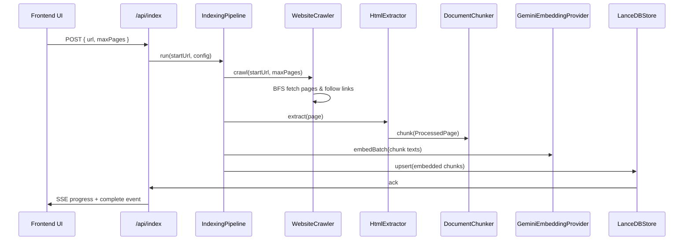

# Data Flow

This document describes the different data flows in the application.

## Request Flow

1. User enters a website URL or chat question in the UI.
2. The client posts data to either `/api/index` or `/api/chat`.
3. The API route validates the request.
4. The route resolves dependencies using the factory and invokes the appropriate service.
5. The result is returned to the UI.

## Indexing Flow



### Indexing Sub-Flows

- `Crawler`: Performs domain-limited BFS, `robots.txt` validation, HTTP HTML fetch, title extraction, and link discovery.
- `HtmlExtractor`: Converts raw HTML to clean semantic text using Readability and Cheerio.
- `DocumentChunker`: Splits text into overlapping chunks with chunk size and overlap rules.
- `GeminiEmbeddingProvider`: Generates dense vectors and normalizes them.
- `LanceDBStore`: Stores vectors and metadata for later retrieval.

## Chat Flow

```mermaid
graph TD
  User[User Query] --> UI[Next.js UI]
  UI --> API[/api/chat]
  API --> ChatService[ChatService]
  ChatService --> Retriever[Retriever]
  Retriever --> GeminiEmbeddingProvider[Embedding Provider]
  GeminiEmbeddingProvider --> Vector[Query Embedding]
  Retriever --> LanceDBStore[Vector Store]
  LanceDBStore --> Chunks[Top-k DocumentChunks]
  ChatService --> PromptBuilder[Prompt Builder]
  PromptBuilder --> GeminiChatProvider[Chat Provider]
  GeminiChatProvider --> Answer[Generated Answer]
  Answer --> API
  API --> UI
```

### Search & Retrieval Flow

- User question text is sent to the `Retriever`.
- `Retriever` creates a query embedding.
- The vector store performs similarity search and returns the most relevant chunks.
- Chunks are mapped into citation objects and included in the prompt.
- `PromptBuilder` formats the final prompt for Gemini.
- `GeminiChatProvider` returns the answer.

## Embedding Flow

- Embeddings are created in two contexts:
  - during indexing for document chunks (`embedBatch`),
  - during query time for user questions (`embed`).
- Dimension validation ensures query embedding length matches store configuration.
- L2 normalization is applied consistently to all embeddings.

## Vector Search Flow

- `LanceDBStore.similaritySearch()` accepts the query embedding and a `topK` limit.
- Optional metadata filters can be converted into SQL-like `WHERE` clauses.
- The store returns `DocumentChunk` objects with `score` populated from LanceDB's `_distance` field.
- The retrieval pipeline sorts by similarity and returns the top results.

## Progress and Telemetry Flow

- `IndexingPipeline` emits progress events via `onProgress`.
- These events are forwarded as SSE to the frontend from `src/app/api/index/route.ts`.
- Progress includes stages: `initialize`, `crawl`, `extract`, `chunk`, `embed`, `store`, and `complete`.
- The chat path logs internal timing but does not stream progress.
