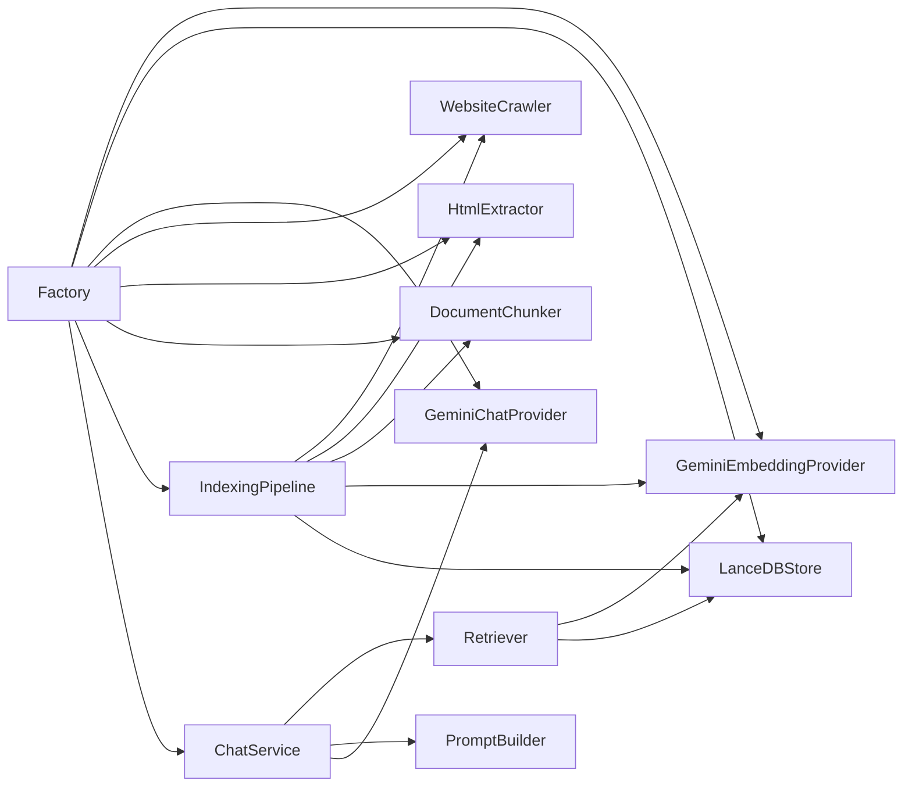

# Dependency Injection

This document explains how dependency injection is used in the project.

## Patterns Used

### Factory Pattern

- `src/lib/chat/factory.ts` is the composition root.
- It creates concrete implementations of:
  - `GeminiEmbeddingProvider`
  - `LanceDBStore`
  - `Retriever`
  - `PromptBuilder`
  - `GeminiChatProvider`
  - `WebsiteCrawler`
  - `HtmlExtractor`
  - `DocumentChunker`
  - `IndexingPipeline`

### Interfaces and Abstractions

The project defines interfaces to decouple implementation from usage:

- `VectorStore` in `src/types/index.ts`
- `EmbeddingProvider` in `src/lib/llm/embedding-provider.ts`
- `ChatProvider` in `src/lib/llm/chat-provider.ts`
- `Crawler` in `src/lib/crawler/index.ts`

These interfaces allow service classes to depend only on contracts rather than concrete classes.

## Composition Root

The factory is responsible for:

- validating required environment variables such as `GEMINI_API_KEY`
- creating shared dependencies with configuration defaults
- initializing the LanceDB store before use
- returning fully constructed service objects to API routes

## Dependency Graph

## SOLID Principles

### Single Responsibility Principle

- Each class has a focused responsibility.
- `WebsiteCrawler` handles crawling state, while `HtmlParser` and `RobotsChecker` handle HTML parsing and robots rules.
- `ChatService` handles chat orchestration, while `Retriever` handles retrieval.

### Open/Closed Principle

- The core logic is open to extension via new `VectorStore`, `EmbeddingProvider`, or `ChatProvider` implementations.
- Existing code does not require modification to support additional providers.

### Liskov Substitution Principle

- The `VectorStore`, `EmbeddingProvider`, and `ChatProvider` interfaces allow interchangeable implementations.
- `MockVectorStore` can substitute `LanceDBStore` in tests.

### Interface Segregation Principle

- Interfaces define narrowly scoped operations for each component type.
- The chat pipeline does not depend on vector store mutation methods it does not use.

### Dependency Inversion Principle

- High-level modules depend on abstractions.
- Concrete classes are instantiated only at the edges (factory and API routes).

## Why DI Matters Here

- It enables the chat and indexing paths to remain decoupled from storage and provider implementations.
- It improves testability by allowing mocks and substitutes.
- It keeps the system flexible and extensible without deep refactoring.
