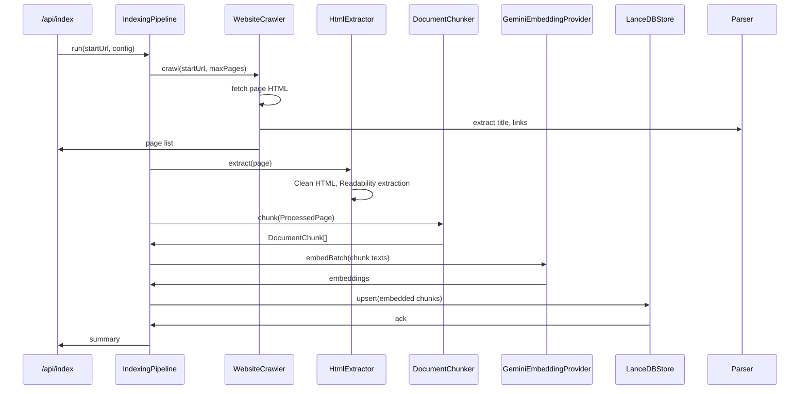

# Indexing Pipeline

This document explains each stage of the indexing pipeline and the classes responsible for them.

## Pipeline Overview

The indexing pipeline transforms a website into vectorized document chunks stored in LanceDB.

### Pipeline stages

1. `WebsiteCrawler` — crawl pages from the target site
2. `HtmlExtractor` — extract and clean HTML into semantic text
3. `DocumentChunker` — split text into overlapping chunks
4. `GeminiEmbeddingProvider` — generate embeddings for each chunk
5. `LanceDBStore` — store embeddings and metadata

## Sequence Diagram

## Detailed Stages

### 1. Crawling

- Class: `src/lib/crawler/crawler.ts`
- Interface: `src/lib/crawler/index.ts` (`Crawler`)
- Purpose: Traverse a website using breadth-first search (BFS), stay within the start domain, and obey `robots.txt`.
- Key responsibilities:
  - normalize URLs and avoid duplicates
  - skip unsupported protocols and non-HTML resources
  - respect `requestDelay` between requests
  - extract page title and links using `HtmlParser`
  - do not queue external domains

### 2. HTML Extraction

- Class: `src/lib/rag/html-extractor.ts`
- Interfaces: `WebPage`, `ProcessedPage`
- Purpose: Convert raw HTML into cleaned content suitable for semantic embedding.
- Key responsibilities:
  - attempt `Readability` extraction for main article content
  - fallback to raw HTML when extraction is not available
  - remove boilerplate elements like `nav`, `footer`, `script`, `style`, and `aside`
  - serialize headings, paragraphs, lists, and code blocks into markdown-like plain text
  - normalize whitespace and collapse excessive line breaks
  - skip pages with content length below `minChars`

### 3. Chunking

- Class: `src/lib/rag/chunker.ts`
- Purpose: Split cleaned text into overlapping semantic chunks to preserve context across embeddings.
- Rules:
  - `chunkSize` default is 1000 characters
  - `chunkOverlap` default is 200 characters
  - prefer split points on paragraph boundaries, line breaks, sentence endings, then word boundaries
  - guarantee chunk IDs with UUIDs
  - record chunk metadata like `startOffset`, `endOffset`, and `chunkIndex`

### 4. Embedding

- Class: `src/lib/llm/gemini-embedding.ts`
- Interface: `EmbeddingProvider`
- Purpose: Convert chunk text into dense vectors for semantic search.
- Key behaviors:
  - batch embeddings using `batchSize`
  - validate output dimensions match `embeddingDimension`
  - optionally normalize vectors using L2 normalization
  - handle retryable errors and surface rate limit errors as `GeminiRateLimitError`
  - support sequential batch processing with logs

### 5. Vector Store Storage

- Class: `src/lib/db/lancedb-store.ts`
- Interface: `VectorStore`
- Purpose: Persist document chunks and embeddings for efficient similarity search.
- Responsibilities:
  - connect to a local LanceDB directory and create a typed table schema
  - store metadata fields and fixed-length vector list column
  - implement `similaritySearch`, `upsert`, `delete`, `count`, and `clear`
  - build SQL-style metadata filters from generic `MetadataFilter`
  - handle dimension mismatches and data validation

## Pipeline Behavior and Resilience

- `IndexingPipeline.run()` ensures configuration values are within valid bounds.
- Clearing the database is optional via `clearExisting`.
- The pipeline gracefully skips pages where extraction or chunking fails, while continuing the remainder.
- Batch embedding and storage are performed in chunks to reduce memory pressure.
- Rate-limit errors during embedding trigger retry loops with progress updates.
- The pipeline emits progress events through `onProgress` for real-time feedback.

## Key Design Notes

- The indexing pipeline is intentionally independent of the chat path, so the vector store is the shared persistence boundary.
- It is built for local file persistence with LanceDB, not as a distributed production vector database.
- The pipeline relies on the browser/node `fetch` API for HTML retrieval.
